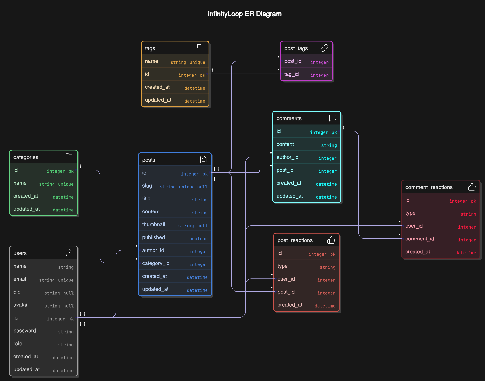

# InfinityLoop Database Documentation

## Overview

This document provides a brief description of each entity in the **InfinityLoop** database. The platform supports **user management, content creation, categorization, commenting, and reaction features**.

## 🔥 Entity-Relationship Diagram (ERD)

Below is the ER Diagram representing the database schema.

> For the updated ER diagram, check here: [InfinityLoop ER Diagram](https://app.eraser.io/workspace/LYh0oePePyPQ4AYebHyf?origin=share).

## 📌 Database Entities

### 1️⃣ User

The User entity represents registered users of the platform.

- **Purpose**: Stores user account information and authentication details
- **Key Fields**: ID, name, email, password, role
- **Relationships**: Users create posts and comments, and can react to content
- **Notes**: Implements role-based access control with default role of USER

### 2️⃣ Post

The Post entity represents articles or blog entries.

- **Purpose**: Stores blog content created by users
- **Key Fields**: ID, title, content, slug, published status
- **Relationships**: Each post has an author (User), belongs to a Category, can have multiple Tags, Comments, and Reactions
- **Notes**: Posts can be drafted (unpublished) or published

### 3️⃣ Category

The Category entity allows for content organization.

- **Purpose**: Classifies posts into distinct topic areas
- **Key Fields**: ID, name
- **Relationships**: One category can contain multiple posts
- **Notes**: Categories help with content discovery and navigation

### 4️⃣ Tag

The Tag entity provides granular content labeling.

- **Purpose**: Allows for more specific content classification
- **Key Fields**: ID, name
- **Relationships**: Tags have a many-to-many relationship with Posts through PostTag
- **Notes**: Tags improve searchability and content discovery

### 5️⃣ PostTag

The PostTag entity is a junction table.

- **Purpose**: Implements the many-to-many relationship between Posts and Tags
- **Key Fields**: postId, tagId (composite primary key)
- **Relationships**: Links Posts to Tags
- **Notes**: Uses cascade deletion to maintain referential integrity

### 6️⃣ Comment

The Comment entity represents user responses to posts.

- **Purpose**: Stores user-generated discussion on posts
- **Key Fields**: ID, content, authorId, postId
- **Relationships**: Each comment belongs to a User (author) and a Post
- **Notes**: Comments can receive reactions from users

### 7️⃣ PostReaction

The PostReaction entity represents user engagement with posts.

- **Purpose**: Tracks user reactions/likes on posts
- **Key Fields**: ID, type, userId, postId
- **Relationships**: Links a User to a Post with a reaction type
- **Notes**: Unique constraint ensures one reaction per user per post

### 8️⃣ CommentReaction

The CommentReaction entity represents user engagement with comments.

- **Purpose**: Tracks user reactions/likes on comments
- **Key Fields**: ID, type, userId, commentId
- **Relationships**: Links a User to a Comment with a reaction type
- **Notes**: Unique constraint ensures one reaction per user per comment
